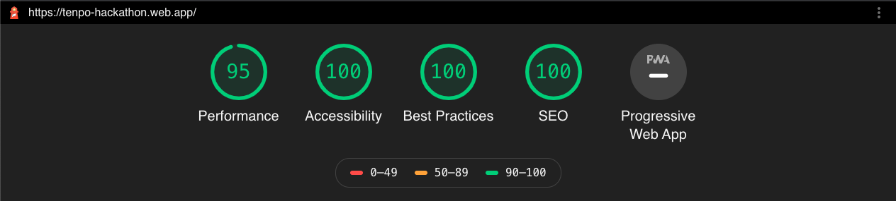

## 1. Descripción del producto📎
Tenpo es una aplicación financiera puesta en marcha el presente año y que busca democratizar el acceso a los productos financieros a través de acercar las finanzas a la gente con transparencia, contenido y educación, aspiran a realizar una transformación en las finanzas de la región. Actualmente su funcionamiento se encuentra certificado por la Comisión para el Mercado Financiero (CMF).
Para lograr esto ofrecen la opción de abrir una cuenta digital gratuita con la que se pueden realizar recargas, pagos de cuentas y transferencias entre usuarios y usuarias de la aplicación y una tarjeta Mastercard Tenpo que entrega la opción de compras internacionales con una tarjeta Mastercard digital que funciona a través de prepago. 
Se puede acceder a ambas opciones a través de la aplicación Tenpo disponible para iOS y Android. Para poder acceder a los productos ofrecidos se requiere ser mayor de edad y entregar información como ocupación, dirección y numero de serie del carnet de identidad.
A través de esto es que la empresa busca cumplir su objetivo de democratización de acceso a productos financieros, ya que entregan acceso a tarjetas que permiten compras internacionales en distintos lugares, rompiendo los limites burocráticos impuestos por las entidades bancarias para otorgar tarjetas de crédito. 

## 2. Problemática
Apertura de cuenta remota para personas con habilidades diferentes:  

¿Cómo podemos lograr que una persona con habilidades diferentes puedan lograr la apertura de una cuenta remota con Tenpo? En este contexto podríamos lograr que pueda cumplir sus obligaciones financieras con una herramienta mucho más amigable.

## 3. Nuestra solución 💡
A medida que conversamos con personas con disminución visual, descubrimos que los celulares en la actualidad vienen dotados de herramientas de accesibilidad que resultan bastante útiles para los y las usuarias. 
Al investigar este descubrimiento aprendimos que para el 2014 el 82% de los screen readers fueron usados en dispositivos móviles, pero además nos dimos cuenta, poseen políticas de accesibilidad claramente estipuladas que determinan formas de sintaxis para que el código funcione de manera fluida y sea un aporte real para las personas con discapacidad. 
Debido que esta es una aplicación que ya se encuentra funcionando plenamente, consideramos que la mejor solución que podíamos entregar era la de adaptar el código actual a una sintaxis que sea apropiada para funcionar de forma eficiente con los screen readers disponibles en los distintos sistemas operativos, al mismo tiempo que mejorar la presentación visual para generar una mejor comunicación con las y los usuarios pero también para que los tamaños de letra y contraste sean apropiados para personas con disminución visual y con problemas de movilidad reducida menores.
La solución que proponemos es un código que cumpla con los requerimientos [Web Content Accessibility Guidelines (WCAG) 2.1](https://www.w3.org/TR/WCAG/#abstract) y un diseño visual que cumpla tanto con los requerimientos de los [Human Interface Guidelines para iOS](https://developer.apple.com/design/human-interface-guidelines/ios/overview/themes/) como los de [Material Design para accesibilidad](https://material.io/design/usability/accessibility.html#assistive-technology). Todo para entregar un producto que responda de la mejor forma posible a las herramientas de accesibilidad disponible en los celulares.

## 4. UX
 
 Para el diseño del presente proyecto se recurrió principalmente al Design Sprint, proceso de diseño que busca obtener un equilibrio entre las necesidades de los y las usuarias, de la empresa y de la tecnología disponible; en períodos de tiempo acotados. El Design Sprint original está pensado para entregar una solución en 5 días.  
  
 **4.1 Map** 
En esta etapa logramos identificar el problema e identificar los factores que influyen en el. 
Respecto a la situación financiera de nuestro país nos encontramos con que de acuerdo con la Superintendencia de Bancos e Instituciones Financieras (SBIF) el 97% de los chilenos adultos tiene acceso a productos financieros, sin embargo, solo el 10% tiene acceso a líneas de créditos; es decir, la población chilena se encuentra sub bancarizada. Además el 92% de las personas no se encuentra feliz con los servicios bancarios que tiene, esto redunda directamente en una desconfianza hacia los servicios financieros que se evidencia a través del desinterés en la app motivado en la cantidad de datos que se requieren para comenzar a utilizarla antes de conocerla y decidir si quieren confiar en ella o no.
Analizamos también otras aplicaciones financieras donde pudimos comprobar que Tenpo es de las que menos documentos requiere para iniciar una cuenta digital.
En paralelo, trabajamos temas relacionados con la accesibilidad y llegamos a la hipótesis de que actualmente existen muchas herramientas disponibles para apoyar la accesibilidad en los dispositivos móviles, sin embargo, al momento de desarrollar las aplicaciones se dejan de lado una serie buenas prácticas que podrían hacer de la accesibilidad algo común. Si logramos ajustar el código a los estándares establecidos podremos entregar una aplicación accesible para muchas más personas. 
Con esto en mente procedimos a realizar una investigación de las distintas alternativas de accesibilidad que existen presentes en el mercado destacándose entre ellas a aplicación Lazarillo que consiste en un GPS accesible para personas con ceguera o baja visión.
Para el proceso de empatizar se llevaron a cabo tres entrevistas con personas de distintas edades y grados de disminución visual, dos de ellas asociadas a glaucoma y otra persona con hipermetropía. Manifestaron que les es más fácil leer cuando los fondos son oscuros y con letras claras (modo oscuro) y que requerían tener tamaños grandes de letras o agregar la opción de zoom para poder ver tamaños pequeños de letras que además debían tener un contraste claro con el fondo, respectivamente.
  
**4.2 Sketch** 
El proceso de skecth implica tratar de imaginar soluciones creativas al problema con que nos encontramos, para lo que hicimos una pequeña lluvia de ideas de la que salieron soluciones como incorporar opción de llenado por voz, reestructuración del código para ser accesible para todas las personas con discapacidad y el separar los procesos de registro para así darle la oportunidad a usuarios y usuarias de conocer la aplicación previo a decidir si quieren abrir su cuenta, fomentando de este modo la confianza en la aplicación.
 
El sketch que se ve a continuación fue elaborado en conjunto por el equipo.
 
**4.3 Decide** 
Debido al tiempo acotado que existe para poder desarrollar la solución decidimos enfocar el trabajo en personas con disminución visual y proyectamos aplicar las mejoras recomendadas para que el código entregue toda la información requerida por los screen reader y la lectura de pantalla sea exitosa para quieres la requieran. También nos decidimos a tratar de separar los procesos de registro en varias fases dándole la opción de conocer la app en una etapa temprana para entregar al usuario o usuaria el poder de decidir si quieren crear cuentas o no, todo esto acompañado de un diseño visual acorde a las necesidades de personas con disminución visual pero que aun no requieran un screen reader. 
 
**4.4 Prototype**
El prototipo fue realizado en Figma e incorpora cambios a distintos niveles
-	Colores: se usan colores que ya se encontraban dentro del manual de la marca y que generan contrastes de 7.21:1 (el mínimo para tener accesibilidad AAA es de 7:1 para textos pequeños) con el objetivo de lograr una mejor visibilidad del texto. 
-	Tipografía: se trabajo con Roboto ya que -después de SF pro- es una de las tipografías con menor distorsión y por ende mas legible. A continuación se puede ver una grafica comparativa entre ambas tipografías y su visualización en base a distintos problemas a la vista 

Además se utilizaron los tamaños xxLarge de la tabla tamaños de tipo dinámico. 
-	Modo oscuro: se realizó el prototipado del modo oscuro de la app ya que esta herramienta ayuda a personas con glaucoma o que tienen dificultad para leer con fondos claros. 
-	 Información: se trato de entregar la mayor cantidad de información a medida que se avanzaba en las etapas de registro para generar una sensación de transparencia. 
-	Estructura: se modificó levemente el proceso de registro para dar la opcion a usuarios y usuarias de poder conocer la app antes de decidir si quieren generar una cuenta con la empresa. 
-	Jerarquía: se aplicaron principios de jerarquías claros y repetitivos en todas las pantallas para facilitar la lectura tanto con screen readers como para personas con visión disminuida. 
El prototipo del modo light se puede ver haciendo [click aquí]( https://www.figma.com/proto/6011A88Ez1unQymFno3TdL/Tenpo?node-id=1%3A3&scaling=scale-down) y el prototipo versión dark se puede ver haciendo [click aquí]( https://www.figma.com/file/6011A88Ez1unQymFno3TdL/Tenpo?node-id=64%3A523).
  
**4.5 Testing**
El testeo para esta aplicación fue particularmente difícil dadas las circunstancias internacionales que nos impiden reunirnos para realizar las evaluaciones, lo que nos obliga a ayudarnos de plataformas digitales de testeo que han probado ser deficientes en temas de accesibilidad. Por lo que, pese a que la app si es accesible, las herramientas para testearlas muchas veces no lo son.
Se procedió a testear por videollamada con 3 personas, se aplicó un tipo de testeo mixto ya que hubo etapas de A/B testing, entrevista y una tarea a cumplir. Para el testeo se trabajó con el deploy de la aplicación ya que es mucho mas flexible que el testeo de prototipo
En primer lugar les mostró en tamaño real imágenes del prototipo y de la aplicación actual para evaluar cual era mas legible y las 3 personas consideraron que la nueva propuesta les resultaba mucho mas fácil de acceder. 
En segundo lugar se les pidió que buscaran cómo llenar la sección de llenar el número de serie y todas refirieron que les fue fácil de encontrar y que el link de ayuda simplificaba la operación.

### 5. Definición de usuario

### 6. Historia de Usuario
### 7. Prototipo
 

## Informe sobre el rendimiento de la página (Lighthouse)
# 

## Tecnologías utilizadas ⚙️
Para desarrollar la aplicación se utilizó: 
- React.js
- Material-UI 
- Flexbox
- React Hooks
- React-router-dom

## Link de Deploy 🚀
Puedes entrar al deploy en el siguiente [link](https://tenpo-hackathon.web.app/)

####  Developers 👩‍💻

* [Daniela González - UX Designer](https://github.com/DaniAzul)  
* [Corina Varas - Frontend](https://github.com/CorinaVaras)
* [Geraldine Becerra - Frontend](https://github.com/andgerald) 
* [Veronica Urrutia - Frontend](https://github.com/veronicaurrutia)